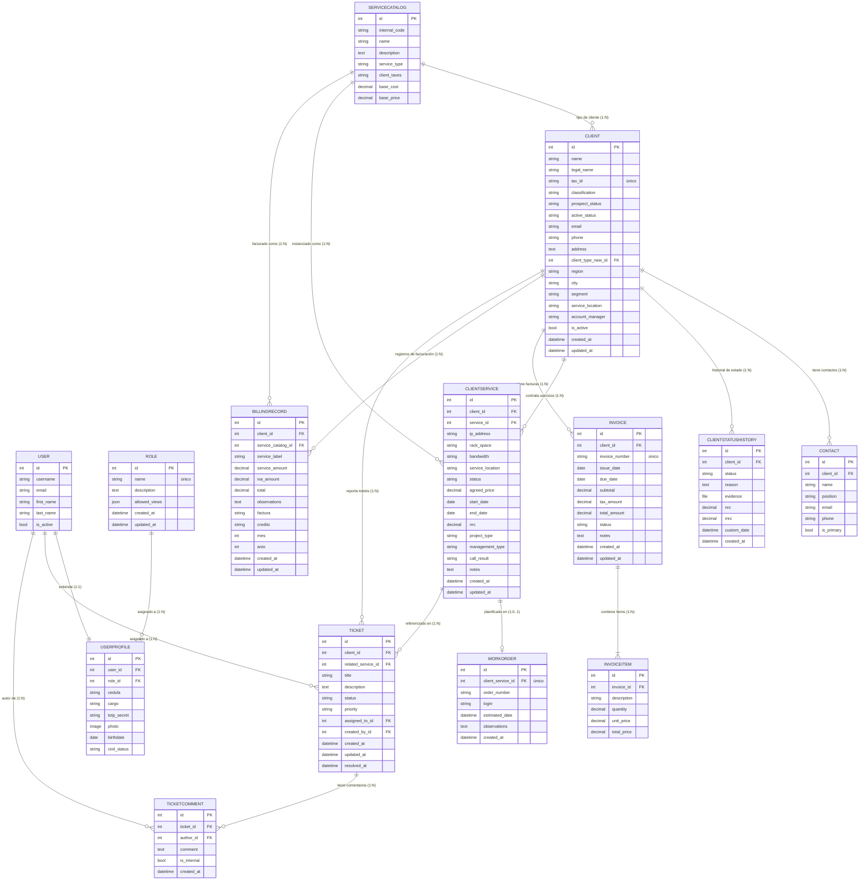

# Diagrama Entidad-Relación — CRM DataCom

Este documento describe todas las entidades, atributos y relaciones del sistema CRM DataCom,
extraídas directamente de los modelos Django y sus migraciones.

---

## Diagrama ERD (Mermaid)

---

## Tabla de Entidades

| Entidad               | App       | Descripción                                                    |
|-----------------------|-----------|----------------------------------------------------------------|
| `USER`                | auth      | Usuario del sistema (Django built-in)                         |
| `ROLE`                | core      | Rol de acceso basado en permisos                              |
| `USERPROFILE`         | core      | Perfil extendido del usuario CRM                              |
| `CLIENT`              | clients   | Prospecto o cliente activo de DataCom                         |
| `CONTACT`             | clients   | Persona de contacto dentro de una organización cliente        |
| `CLIENTSTATUSHISTORY` | clients   | Historial de cambios de estado del cliente                    |
| `SERVICECATALOG`      | services  | Catálogo maestro de servicios disponibles                     |
| `CLIENTSERVICE`       | services  | Instancia de servicio contratado por un cliente               |
| `WORKORDER`           | services  | Orden de trabajo para instalación de un servicio              |
| `INVOICE`             | billing   | Factura emitida a un cliente                                  |
| `INVOICEITEM`         | billing   | Línea de detalle de una factura                               |
| `BILLINGRECORD`       | billing   | Registro mensual de facturación por cliente/servicio          |
| `TICKET`              | support   | Incidencia o solicitud de soporte de un cliente               |
| `TICKETCOMMENT`       | support   | Comentario o actualización sobre un ticket                    |

---

## Tabla de Relaciones

| Entidad Origen        | Cardinalidad | Entidad Destino       | Campo FK / Tipo          | Descripción                                         |
|-----------------------|--------------|-----------------------|--------------------------|-----------------------------------------------------|
| `USER`                | 1:1          | `USERPROFILE`         | `user` (OneToOneField)   | Cada usuario tiene exactamente un perfil CRM        |
| `ROLE`                | 1:N          | `USERPROFILE`         | `role` (ForeignKey)      | Un rol puede asignarse a múltiples perfiles         |
| `SERVICECATALOG`      | 1:N          | `CLIENT`              | `client_type_new` (FK)   | Tipo de cliente referencia al catálogo              |
| `CLIENT`              | 1:N          | `CONTACT`             | `client` (ForeignKey)    | Un cliente puede tener múltiples contactos          |
| `CLIENT`              | 1:N          | `CLIENTSTATUSHISTORY` | `client` (ForeignKey)    | Cada cambio de estado queda registrado              |
| `CLIENT`              | 1:N          | `CLIENTSERVICE`       | `client` (ForeignKey)    | Un cliente puede contratar varios servicios         |
| `CLIENT`              | 1:N          | `INVOICE`             | `client` (ForeignKey)    | Un cliente puede tener múltiples facturas           |
| `CLIENT`              | 1:N          | `BILLINGRECORD`       | `client` (ForeignKey)    | Un cliente tiene registros mensuales de facturación |
| `CLIENT`              | 1:N          | `TICKET`              | `client` (ForeignKey)    | Un cliente puede reportar múltiples tickets         |
| `SERVICECATALOG`      | 1:N          | `CLIENTSERVICE`       | `service` (ForeignKey)   | Un servicio del catálogo puede instanciarse N veces |
| `SERVICECATALOG`      | 1:N          | `BILLINGRECORD`       | `service_catalog` (FK)   | Un servicio puede aparecer en múltiples registros   |
| `CLIENTSERVICE`       | 1:0..1       | `WORKORDER`           | `client_service` (O2O)   | Un servicio puede tener como máximo una orden de trabajo (opcional) |
| `CLIENTSERVICE`       | 1:N          | `TICKET`              | `related_service` (FK)   | Un servicio puede tener múltiples tickets           |
| `INVOICE`             | 1:N          | `INVOICEITEM`         | `invoice` (ForeignKey)   | Una factura contiene una o más líneas de detalle    |
| `TICKET`              | 1:N          | `TICKETCOMMENT`       | `ticket` (ForeignKey)    | Un ticket puede tener múltiples comentarios         |
| `USER`                | 1:N          | `TICKET`              | `assigned_to` (FK)       | Un usuario puede tener N tickets asignados          |
| `USER`                | 1:N          | `TICKET`              | `created_by` (FK)        | Un usuario puede haber creado N tickets             |
| `USER`                | 1:N          | `TICKETCOMMENT`       | `author` (ForeignKey)    | Un usuario puede ser autor de N comentarios         |

---

## Notas de Implementación

- **Claves primarias:** Todas las entidades usan `BigAutoField` generado automáticamente por Django.
- **`CLIENT.client_type_new`:** Campo `ForeignKey` hacia `ServiceCatalog` con `on_delete=SET_NULL`, permitiendo `null`. Sustituye al campo legacy `client_type` (CharField de tipo enum).
- **`CLIENTSERVICE.work_order`:** Relación `OneToOneField` inversa; existe **como máximo una** `WorkOrder` por instancia de servicio (la orden es opcional — un servicio puede estar activo sin una orden de trabajo registrada).
- **`BILLINGRECORD.iva_amount` y `total`:** Calculados automáticamente en `save()` (IVA = 15 % del monto base).
- **`INVOICEITEM.total_price`:** Calculado automáticamente como `quantity × unit_price`.
- **`CLIENTSERVICE.status` → `CLIENT.active_status`/`prospect_status`:** Sincronización automática via override de `save()`.
- **Campos de auditoría:** La mayoría de entidades incluyen `created_at` y `updated_at` (auto-gestionados por Django).
